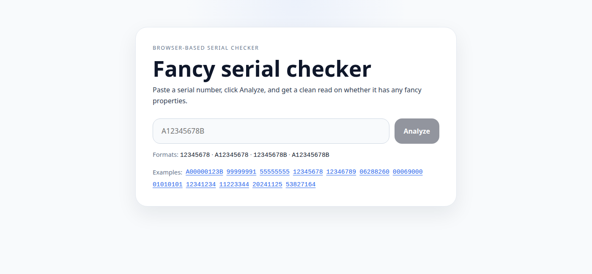

# Fancy serial checker

I originally built a serial analyzer as a pet project for identifying interesting banknote serial numbers and seeing how far I could automate the hunt. The rule set worked, but the bigger logistics problem never really did. Truly fancy serials are rare enough that the operational side of sourcing, sorting, and reviewing notes just does not make much sense at scale.

Rather than let that work die inside a larger dead-end automation idea, I pulled the rules I wrote for the analyzer into this small frontend utility. It gives me a quick way to paste in a serial number and check whether it matches any of the patterns I cared about.



## What it checks

- low serials
- high serials
- solids
- ladders and broken ladders
- radars and super radars
- flippers
- binary notes
- repeaters
- quad doubles
- six of a kind
- seven of a kind
- date notes

## Local development

```bash
npm install
npm run dev
```

The local dev server runs on port `4173`.

## Tests

```bash
npm run test:run
```

The tests mirror representative cases from the original Python analyzer tests, especially around ladder detection, format handling, and analyzer priority.

## Build

```bash
npm run build
npm run verify:dist
```

If I want the full local CI pass:

```bash
npm run ci
```

## GitHub Pages

- `ci.yml` runs install, lint, tests, build, and static asset verification
- `deploy-pages.yml` publishes the built `dist/` directory with GitHub Actions
- `vite.config.ts` uses `base: './'` so assets resolve correctly on GitHub Pages project URLs

## Notes

- Everything runs in the browser. There is no backend.
- The core detection logic was ported from my original Python serial analyzer into TypeScript.
